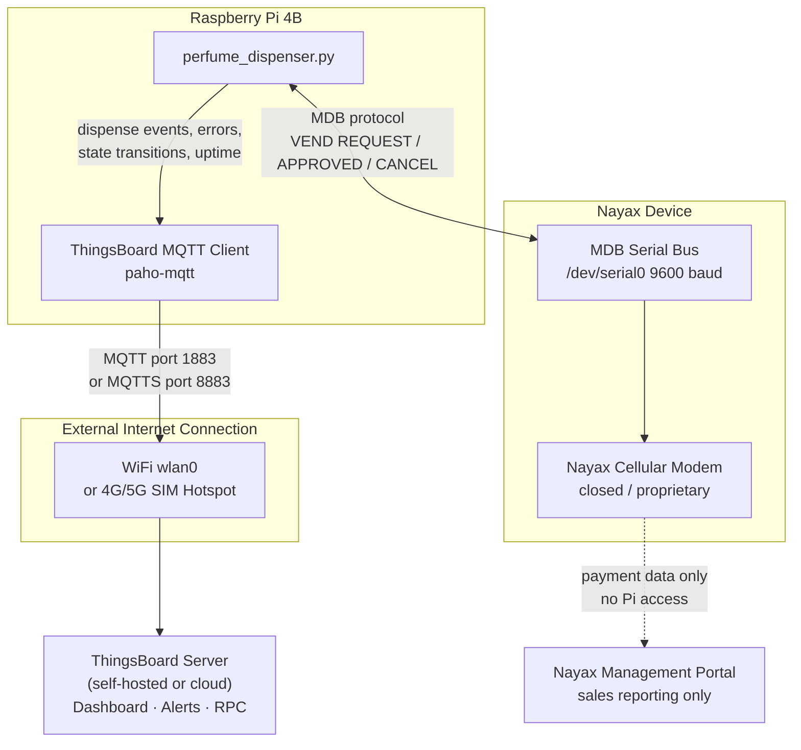

# Connectivity & Monitoring: Why Nayax Is Not Enough and Why We Use ThingsBoard

## 1. System Overview

The perfume dispenser is built around a **Raspberry Pi 4B** as the central controller. It manages:

- **5 relay-driven pumps** (GPIO outputs) that dispense each perfume
- **5 selection buttons** (GPIO inputs) chosen by the customer
- **5 LED indicators** that guide and confirm selections
- **A video player** service that displays promotional content on a screen
- **A Nayax cashless payment device**, connected to the Pi via the **MDB (Multi-Drop Bus) serial protocol** on `/dev/serial0` at 9600 baud

The Raspberry Pi runs a Python application (`perfume_dispenser.py`) that coordinates all of these components: it listens for card taps from Nayax, waits for a button press, fires the correct relay for 1.35 seconds to dispense, and manages the full transaction lifecycle.

```
┌─────────────────────────────────────┐
│          Raspberry Pi 4B            │
│                                     │
│  perfume_dispenser.py               │
│  ├── GPIO: 5× relays (pumps)        │
│  ├── GPIO: 5× LEDs                  │
│  ├── GPIO: 5× buttons               │
│  └── UART /dev/serial0 ──► Nayax   │
│                                     │
│  video_player.py (separate service) │
└─────────────────────────────────────┘
```

---

## 2. What Nayax Provides — and What It Does Not

### What Nayax Is

Nayax is a **cashless payment terminal** designed for unattended retail (vending machines, kiosks). It handles:

- Contactless card / NFC tap (Visa, Mastercard, Apple Pay, Google Pay)
- Communication with card networks and payment processors to approve or decline a charge
- Reporting sales transactions to the **Nayax Management Portal** (NAYAX LUMIN or similar)

Nayax has its own built-in **cellular modem** for exactly this purpose: transmitting payment authorisations to the card network in real time.

### The Critical Limitation: Nayax's Internet Is Payment-Only and Closed

Nayax's cellular connection is **not a general-purpose internet connection**. It is a closed, proprietary link that:

| Property | Nayax Built-in Cellular |
|---|---|
| Who controls it | Nayax (the company) |
| What it carries | Payment authorisation messages only |
| Protocol | Proprietary Nayax protocol to Nayax servers |
| Can the Raspberry Pi use it? | **No** |
| Does it appear as a network interface on the Pi? | **No** |
| Can it be tunnelled or shared? | **No** |

The Pi talks to Nayax over **MDB**, which is a low-level vending machine serial bus — not a network. MDB only carries vending commands:

```
Pi → Nayax:  POLL / ENABLE / VEND REQUEST ($2.00) / VEND SUCCESS / SESSION END
Nayax → Pi:  JUST RESET / BEGIN SESSION / VEND APPROVED / VEND DENIED / END SESSION
```

There is no socket, no IP address, no HTTP endpoint, and no SSH tunnel available through Nayax. The Raspberry Pi's Linux network stack (`eth0`, `wlan0`) receives **nothing** from Nayax's modem.

### What the Nayax Portal Cannot Tell You

Even if you log into the Nayax Management Portal, you only see what Nayax knows — which is only the payment side:

| Data Point | Nayax Portal | Required for Operations |
|---|---|---|
| Transaction approved / denied | ✅ Yes | Yes |
| Sale amount and timestamp | ✅ Yes | Yes |
| Which perfume slot was dispensed | ❌ No | Yes |
| Relay activation time / duration | ❌ No | Yes |
| Button press events | ❌ No | Yes |
| Dispense failures or timeouts | ❌ No | **Critical** |
| MDB state machine transitions | ❌ No | Yes |
| Serial port errors | ❌ No | **Critical** |
| Raspberry Pi uptime / reboots | ❌ No | **Critical** |
| LED / relay hardware faults | ❌ No | **Critical** |
| Software errors and stack traces | ❌ No | **Critical** |
| Remote configuration changes | ❌ No | Yes |

In short: **Nayax knows money moved. It does not know whether a customer actually received their perfume.**

---

## 3. Why We Need an External Internet Connection

Because Nayax's cellular link is inaccessible to the Pi, the device needs its own independent internet connection for:

### 3.1 Operational Telemetry & Monitoring
Every dispense event, payment state change, relay trigger, error, and timeout that happens inside `perfume_dispenser.py` must be reported to an external server in real time. Without this, a broken unit can sit unreported for days.

### 3.2 Real-Time Alerting
- A relay stuck open (perfume wasted or motor running continuously) must trigger an immediate alert.
- A serial port failure (`/dev/serial0` not opening) means the unit cannot accept payments — operators need to know within minutes, not hours.
- A high rate of `VEND DENIED` responses could indicate a hardware or configuration problem.

### 3.3 Remote Configuration
`config.py` defines constants like `ITEM_PRICE`, `RELAY_DURATION`, and `NAYAX_TIMEOUT`. Changing these today requires physical access to the device. With internet connectivity, ThingsBoard's **Shared Attributes** feature can push updated values to the device remotely.

### 3.4 OTA Software Updates
Security patches and feature updates to `perfume_dispenser.py` and `video_player.py` can be pushed remotely (e.g., via `git pull` triggered by a ThingsBoard RPC command) instead of requiring a technician on-site.

### 3.5 Connectivity Options

| Option | Best For | Notes |
|---|---|---|
| **WiFi (wlan0)** | Fixed indoor locations with existing infrastructure (malls, airports, hotels) | Low cost, easy to configure via `wpa_supplicant`; depends on venue's WiFi reliability |
| **4G/5G SIM + Mobile Hotspot** | Standalone kiosk deployments with no local WiFi, or high-uptime requirements | Independent of venue infrastructure; requires a data SIM and a hotspot router or USB modem |

Both options are configured at the OS level (NetworkManager or `wpa_supplicant`) and are completely transparent to the Python application — the app just needs IP connectivity.

---

## 4. Why ThingsBoard Is the Right Monitoring Platform

### 4.1 What ThingsBoard Is

[ThingsBoard](https://thingsboard.io) is an open-source IoT platform built specifically for device telemetry, real-time dashboards, rule-based alerting, and device management. It is widely used in industrial and unattended retail IoT deployments.

### 4.2 It Fits This System Perfectly

| Requirement | ThingsBoard Feature |
|---|---|
| Ingest dispenser events from the Pi | MQTT or HTTP telemetry API |
| Real-time dashboard showing all units | Customisable widget-based dashboards |
| Time-series charts (dispenses per hour, errors) | Built-in time-series storage and chart widgets |
| Alerts when something goes wrong | Rule Engine: trigger email/SMS/webhook on any condition |
| Push config values to the device | Shared Attributes (device reads on connect or subscribe) |
| Send commands to the device | Server-side RPC (e.g., trigger a test dispense, reboot) |
| Track multiple units on one dashboard | Asset and Device hierarchy |

### 4.3 Simple Python Integration

The Raspberry Pi only needs the `paho-mqtt` Python library (no heavy SDK). A minimal telemetry publish looks like:

```python
import paho.mqtt.client as mqtt
import json

THINGSBOARD_HOST = "your-thingsboard-server.com"
ACCESS_TOKEN = "DEVICE_ACCESS_TOKEN"

client = mqtt.Client()
client.username_pw_set(ACCESS_TOKEN)
client.connect(THINGSBOARD_HOST, 1883)

# Called after each successful dispense
def report_dispense(slot: int, duration_ms: int):
    payload = {
        "slot": slot,
        "relay_duration_ms": duration_ms,
        "event": "dispense_success"
    }
    client.publish("v1/devices/me/telemetry", json.dumps(payload))
```

This can run inside `perfume_dispenser.py` or as a lightweight companion service.

### 4.4 Self-Hosted or Cloud — Your Choice

- **ThingsBoard Community Edition (self-hosted)**: Free, full control, runs on any Linux VM or cloud instance. Suitable if you manage your own infrastructure.
- **ThingsBoard Cloud**: Managed SaaS, no server to maintain, free tier available for small deployments.

### 4.5 Comparison: Nayax Portal vs ThingsBoard

| Capability | Nayax Portal | ThingsBoard |
|---|---|---|
| Payment transaction history | ✅ | With integration |
| Dispense event log | ❌ | ✅ |
| Per-slot dispense counts | ❌ | ✅ |
| Error and fault log | ❌ | ✅ |
| Device uptime tracking | ❌ | ✅ |
| Real-time live view | ❌ | ✅ |
| Custom alert rules | ❌ | ✅ |
| Remote configuration | ❌ | ✅ |
| Remote commands / RPC | ❌ | ✅ |
| Multi-unit fleet view | Limited (sales only) | ✅ |
| Open / self-hostable | ❌ | ✅ |

---

## 5. Proposed Architecture



---

## 6. Key Telemetry to Log in ThingsBoard

Each event is tagged with the use-case category it primarily serves:

| Category | Code | Description |
|---|---|---|
| Operational Telemetry & Monitoring | **TM** | Events reported in real time so a broken unit is never silently failed |
| Real-Time Alerting | **AL** | Conditions that must fire an immediate notification to operators |
| Remote Configuration | **RC** | Values that can be updated from ThingsBoard without physical device access |

The following events from `perfume_dispenser.py` should be published as telemetry:

| Category | Event | Telemetry Key(s) | Example Value | Why It Matters |
|---|---|---|---|---|
| **TM** | Card tap received | `event`, `timestamp` | `"card_tap"` | Tracks customer activity and session start |
| **TM** | Payment approved | `event`, `amount_cents` | `"vend_approved"`, `200` | Confirms revenue and successful authorisation |
| **TM** | Payment denied | `event` | `"vend_denied"` | Tracks declined transactions; high rate flags a problem |
| **TM** | Successful dispense | `event`, `slot`, `relay_duration_ms` | `"dispense_success"`, `2`, `1350` | Core operational metric — customer received product |
| **TM** | Session timeout | `event` | `"selection_timeout"` | Customer did not press a button in time; UX issue indicator |
| **TM** | MDB state change | `mdb_state` | `"STATE_WAIT_APPROVAL"` | Full transaction lifecycle visibility for diagnostics |
| **TM** | Relay activation | `relay_pin`, `duration_ms` | `27`, `1350` | Hardware health and per-pump usage tracking |
| **TM** | Device boot | `event`, `sw_version` | `"boot"`, `"1.0.0"` | Detects unexpected reboots; tracks software version |
| **AL** | Failed dispense | `event`, `slot`, `reason` | `"dispense_failure"`, `3`, `"relay_timeout"` | Pump may be stuck or empty — immediate operator alert |
| **AL** | Serial port error | `event`, `error_msg` | `"serial_error"`, `"[Errno 2] No such file"` | `/dev/serial0` unavailable — unit cannot accept payments |
| **AL** | Relay stuck open | `event`, `relay_pin`, `duration_ms` | `"relay_stuck"`, `17`, `9000` | Perfume wasting; motor running beyond expected 1350 ms |
| **AL** | High VEND DENIED rate | `vend_denied_count` | `5` (in 10 min) | Possible hardware or Nayax configuration fault |
| **RC** | Item price | `ITEM_PRICE` | `200` (cents) | Change price remotely without touching `config.py` on device |
| **RC** | Relay duration | `RELAY_DURATION` | `1350` (ms) | Tune dispense time per perfume viscosity without site visit |
| **RC** | Nayax timeout | `NAYAX_TIMEOUT` | `15000` (ms) | Adjust payment wait window remotely |
| **RC** | Item selection timeout | `ITEM_SELECTION_TIMEOUT` | `55000` (ms) | Control how long the unit waits for a button press |

---

## 7. Estimated Monthly Data Usage (25 Customers/Day)

This section sizes the internet connection requirement so the right SIM plan or WiFi allocation can be chosen.

### 7.1 Per-Transaction MQTT Publishes (Happy Path)

Each customer triggers approximately 7 MQTT publishes on the ThingsBoard topic `v1/devices/me/telemetry`:

| # | Event Published | Example JSON Payload | JSON Bytes | + TCP/IP + MQTT Headers | Total |
|---|---|---|---|---|---|
| 1 | Card tap | `{"event":"card_tap"}` | 20 B | ~70 B | 90 B |
| 2 | MDB state: wait approval | `{"mdb_state":"STATE_WAIT_APPROVAL"}` | 38 B | ~70 B | 108 B |
| 3 | Payment approved | `{"amount_cents":200,"event":"vend_approved"}` | 46 B | ~70 B | 116 B |
| 4 | MDB state: wait item | `{"mdb_state":"STATE_WAIT_ITEM"}` | 33 B | ~70 B | 103 B |
| 5 | Dispense success | `{"slot":2,"relay_duration_ms":1350,"event":"dispense_success"}` | 61 B | ~70 B | 131 B |
| 6 | Relay activation | `{"relay_pin":27,"duration_ms":1350}` | 37 B | ~70 B | 107 B |
| 7 | Session end | `{"mdb_state":"STATE_ENDING"}` | 29 B | ~70 B | 99 B |

**Per transaction total: ~754 bytes ≈ 0.74 KB**

> TCP/IP headers (~40 B) + MQTT fixed/variable headers (~30 B) = ~70 B overhead per publish. This is the dominant cost for small IoT payloads.

### 7.2 Background / Ambient Traffic

| Source | Frequency | Bytes per Event | Daily Total |
|---|---|---|---|
| Heartbeat / uptime ping | Every 5 minutes (288×/day) | ~110 B | ~31.7 KB |
| Device boot event | Once per day | ~108 B | ~0.1 KB |
| MQTT TLS handshake (MQTTS) | Once per connection (≈1/day) | ~5,000 B | ~5 KB |

**Background daily total: ~37 KB/day**

### 7.3 Daily and Monthly Totals

| Traffic Source | Daily | Monthly (30 days) |
|---|---|---|
| Transaction telemetry (25 customers × 0.74 KB) | 18.5 KB | 555 KB |
| Heartbeat pings (every 5 min) | 31.7 KB | 951 KB |
| MQTT TLS handshake + boot | 5.1 KB | 153 KB |
| **Subtotal (normal operation)** | **~55 KB** | **~1.66 MB** |
| Safety buffer ×3 (retries, reconnects, QoS retransmits) | ~110 KB | ~3.3 MB |
| **Conservative worst-case total** | **~165 KB/day** | **~5 MB/month** |

### 7.4 What This Means for Your Connection Choice

| Connection Type | Typical Plan | Headroom vs ~5 MB/month |
|---|---|---|
| WiFi (venue or office) | Effectively unlimited | Far more than needed |
| 4G/5G IoT SIM (cheapest tier) | 50–100 MB/month | 10–20× more than needed |
| Standard mobile hotspot plan | 1–10 GB/month | 200–2000× more than needed |

**The ThingsBoard telemetry for this deployment is extremely lightweight — under 5 MB/month even with generous safety margins.** The limiting factor when choosing a SIM plan is not data volume but rather **connection reliability and latency** (to ensure real-time alerts fire promptly). Any IoT SIM plan of 50 MB/month or more is more than sufficient.

> **Note:** These figures cover ThingsBoard telemetry only. If you add OTA software updates (pulling a new version of `perfume_dispenser.py` via `git pull`), each update could add 1–5 MB depending on the diff. OTA updates are infrequent and do not significantly change the monthly average.

---

## 9. Summary

| Layer | Component | Role |
|---|---|---|
| Payment | Nayax device | Accepts card payments via MDB, reports to Nayax portal |
| Control | Raspberry Pi 4B | Runs dispenser logic, GPIO, video |
| Connectivity | WiFi or SIM hotspot | Provides IP internet access for the Pi |
| Monitoring | ThingsBoard | Ingests all dispenser telemetry, dashboards, alerts, remote config |

Nayax handles money. ThingsBoard handles everything else. Neither can substitute for the other, and the external internet connection is the bridge that makes ThingsBoard integration possible.
