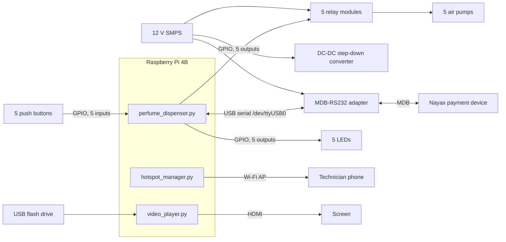
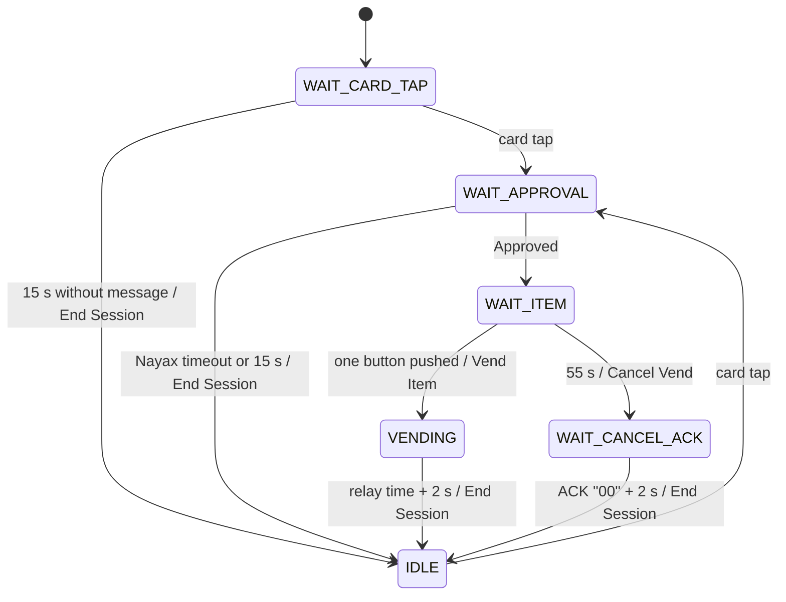

# Perfume Dispenser — Technical Specification

| Item | Value |
|---|---|
| Document type | Technical specification |
| Product | Perfume dispenser with 5 dispensers and cashless payment |
| Software version | 1.1.0 (`config.VERSION`) |
| Hardware reference | Schematic diagram v2.2 |
| Document revision | A |
| Date | 2026-10-04 |
| Language | ASD-STE100 Simplified Technical English, partial application (refer to 1.4) |

---

## 1 Introduction

### 1.1 Purpose

This document gives the technical specification of the perfume dispenser. It describes the hardware, the software, the operating modes and the interfaces. Use this document for installation, test, maintenance and future development.

### 1.2 Scope

This specification applies to software version 1.1.0 and to schematic diagram v2.2. It includes these items:

- The dispenser control application (`perfume_dispenser.py`, `config.py`)
- The Wi-Fi hotspot and the setup portal (`hotspot_manager.py`)
- The payment interface to the Nayax device
- The USB video player (`video_player.py`)
- The Wi-Fi QR code tool (`wifi-qr/`)
- The installation scripts and the `systemd` services

This specification does not include these items:

- The configuration of the Nayax device and the Nayax management portal
- The mechanical design of the enclosure and the perfume reservoirs
- Remote monitoring. This function is a proposal only. Refer to section 14.

### 1.3 Related documents

| Document | Contents |
|---|---|
| `schematics/Perfume Dispenser Schematics Diagram v2.2.jpg` | Wiring diagram |
| `README.md` | Installation and autostart procedures |
| `docs/connectivity-and-monitoring.md` | Proposal for remote monitoring with ThingsBoard |
| `wifi-qr/README.md` | Wi-Fi QR code tool |

### 1.4 Language and conventions

Most of this document obeys the rules of ASD-STE100 Simplified Technical English. Sentences are short. Each sentence gives one idea. Procedures use the imperative form. Each step in a procedure gives one instruction.

Some text does not obey all of the rules:

- File names, parameter names, commands, protocol names and log messages are technical names. This document uses them without change.
- Tables use short phrases. Table cells are not always full sentences.
- Some technical words are not in the STE dictionary, for example "hotspot", "portal" and "timeout". There is no approved word with the same meaning.

This document uses these words with these meanings:

| Word | Meaning |
|---|---|
| must | A mandatory requirement |
| can | A possibility or a permission |
| WARNING | An instruction that prevents injury or death |
| CAUTION | An instruction that prevents damage to equipment or loss of data |
| NOTE | Information that helps you |

### 1.5 Abbreviations

| Abbreviation | Meaning |
|---|---|
| ACK | Acknowledgement |
| AP | Access point |
| BCM | Broadcom GPIO numbering |
| DHCP | Dynamic Host Configuration Protocol |
| DNS | Domain Name System |
| GPIO | General-purpose input/output |
| HTTP | Hypertext Transfer Protocol |
| LED | Light-emitting diode |
| MDB | Multi-Drop Bus (vending machine bus) |
| NM | NetworkManager |
| PSK | Pre-shared key |
| QR | Quick Response (2D code) |
| SMPS | Switched-mode power supply |
| SSID | Wi-Fi network name |
| USB | Universal Serial Bus |
| WPA2 | Wi-Fi Protected Access 2 |

---

## 2 System description

### 2.1 Function

The perfume dispenser sells one spray of perfume for each payment. The customer pays with a card or a phone at the Nayax payment device. Then the customer selects one of five perfumes with a push button. The controller energizes the related air pump for a set time.

A screen shows promotional videos from a USB flash drive. This function is independent of the sales function.

A test mode lets a technician dispense without payment. In test mode, the unit also starts a Wi-Fi hotspot. A technician can use a phone to change the dispense time.

### 2.2 Block diagram



### 2.3 Main components

| Component | Quantity | Description |
|---|---|---|
| Controller | 1 | Raspberry Pi 4B with Raspberry Pi OS (Debian, 64-bit) |
| Payment device | 1 | Nayax cashless reader with MDB interface |
| Payment interface | 1 | MDB-RS232 adapter. It connects to a USB port of the controller. |
| Relay module | 5 | Single-channel 12 V relay module (SRD-12VDC type), high/low trigger selectable |
| Air pump | 5 | One pump for each perfume |
| Push button | 5 | Illuminated metal push button, one for each perfume |
| LED indicator | 5 | One indicator for each perfume |
| Power supply | 1 | 12 V SMPS |
| DC-DC converter | 1 | Step-down converter. Refer to schematic v2.2 for the output connections. |
| Screen | 1 | Shows the promotional video. It is not shown on schematic v2.2. |

---

## 3 Hardware specification

### 3.1 Power supply

The 12 V SMPS supplies these items:

- The 5 relay modules and the 5 air pumps
- The DC-DC step-down converter
- The MDB-RS232 adapter, through a DC barrel jack

> **WARNING:** Disconnect the mains supply before you do work on the power supply. The SMPS input is at mains voltage. Mains voltage can kill you or cause injury.

### 3.2 GPIO assignment

The software uses BCM numbering. The table also gives the physical pin number on the 40-pin header.

| Dispenser | Relay output (BCM / pin) | LED output (BCM / pin) | Button input (BCM / pin) |
|---|---|---|---|
| 1 | GPIO 4 / pin 7 | GPIO 26 / pin 37 | GPIO 13 / pin 33 |
| 2 | GPIO 17 / pin 11 | GPIO 20 / pin 38 | GPIO 21 / pin 40 |
| 3 | GPIO 27 / pin 13 | GPIO 8 / pin 24 | GPIO 16 / pin 36 |
| 4 | GPIO 22 / pin 15 | GPIO 25 / pin 22 | GPIO 7 / pin 26 |
| 5 | GPIO 5 / pin 29 | GPIO 23 / pin 16 | GPIO 24 / pin 18 |

The electrical logic is as follows:

| Signal | Direction | Active level | Initial state |
|---|---|---|---|
| Relay | Output | HIGH energizes the relay | LOW (relay de-energized) |
| LED | Output | HIGH turns the LED on | LOW (LED off) |
| Button | Input, internal pull-up | LOW (the button connects the pin to GND) | — |

You can change the pin assignment in `config.py`. The software must have exactly 5 relays, 5 LEDs and 5 buttons. If not, the software stops at startup with a configuration error.

> **CAUTION:** Do not connect 5 V or 12 V to a GPIO pin. The GPIO pins operate at 3.3 V. A higher voltage causes permanent damage to the controller.

> **CAUTION:** Do not enable the SPI0 interface. GPIO 7 and GPIO 8 are the SPI0 chip-select pins. If SPI0 is enabled, button 4 and LED 3 can stop operation.

### 3.3 Relay modules and air pumps

Each relay module has a 12 V coil. The trigger input of the module connects to a 3.3 V GPIO output. The software energizes a relay with a HIGH level.

- Set the trigger jumper of each relay module to high-level trigger.
- The relay contact supplies 12 V to the related air pump.
- The software de-energizes all relays at startup and at normal shutdown.

### 3.4 Payment interface

| Parameter | Value |
|---|---|
| Device | Nayax with MDB, through an MDB-RS232 adapter |
| Connection to controller | USB |
| Serial port | `/dev/ttyUSB0` (`TTL_SERIAL_PORT`) |
| Baud rate | 9600 (`TTL_BAUD_RATE`) |
| Format | 8 data bits, no parity, 1 stop bit |
| Read timeout | 0.1 s |

Refer to section 6 for the message set.

---

## 4 Software specification

### 4.1 Software items

| File | Function |
|---|---|
| `perfume_dispenser.py` | Main application. It controls the GPIO, the payment session and test mode. |
| `config.py` | Configuration parameters and pin assignment |
| `hotspot_manager.py` | Wi-Fi hotspot and setup portal for test mode |
| `video_player.py` | USB video player (separate service) |
| `test_buttons.py` | Hardware test for the 5 button inputs |
| `run.sh` | Manual start script. It checks the Python packages, then starts the application. |
| `install-service.sh` | Installs `perfume-dispenser.service` |
| `install-video-player.sh` | Installs `video-player.service` and, as an option, `mpv` |
| `perfume-dispenser.service` | `systemd` unit for the main application |
| `video-player.service` | `systemd` unit for the video player |
| `wifi-qr/generate_wifi_qr.py` | Makes a Wi-Fi QR code for one unit (runs on a separate computer) |

### 4.2 Runtime environment

| Item | Requirement |
|---|---|
| Python | 3.10 or later. `hotspot_manager.py` uses the `str \| None` type syntax. |
| Python packages | `RPi.GPIO` 0.7.1 or later, `pyserial` 3.5 or later |
| Network tools | NetworkManager (`nmcli`), and `nft` or `iptables` |
| Video tools | `mpv`, `omxplayer` or `vlc`. `ffprobe` is optional. |
| Permissions | The main application must run as `root`. Refer to 7.6. |

### 4.3 Threads and timing loops

| Thread | Period | Function |
|---|---|---|
| Main loop | 10 ms | Reads buttons, controls LEDs and relays, monitors timeouts |
| Serial reader | 1 ms | Reads and decodes data from the payment interface |
| Hotspot enable / disable | Single run | Starts or stops the hotspot. The main loop does not wait. |
| Portal HTTP server | Continuous, while the hotspot is on | Serves the setup portal |

### 4.4 Configuration parameters

All parameters are in `config.py`.

| Parameter | Value | Unit | Function |
|---|---|---|---|
| `VERSION` | `1.1.0` | — | Software version. The log shows it. |
| `TEST_MODE_HOLD_MS` | 20 000 | ms | Hold time of button 1 and button 5 to enter or exit test mode |
| `RELAY_PINS` | 4, 17, 27, 22, 5 | BCM | Relay outputs |
| `LED_PINS` | 26, 20, 8, 25, 23 | BCM | LED outputs |
| `BUTTON_PINS` | 13, 21, 16, 7, 24 | BCM | Button inputs |
| `TTL_SERIAL_PORT` | `/dev/ttyUSB0` | — | Serial port of the payment interface |
| `TTL_BAUD_RATE` | 9600 | baud | Serial speed |
| `ITEM_PRICE` | 200 | minor currency unit | Price of one spray. The log shows it as $2.00. |
| `ITEM_SELECTION_TIMEOUT` | 55 000 | ms | Time for the customer to push a button after approval |
| `RELAY_DURATION` | 1 350 | ms | Dispense time (relay energized) |
| `POST_DISPENSE_DELAY` | 2 000 | ms | Delay before End Session, after a dispense or a cancel ACK |
| `FLASH_INTERVAL` | 500 | ms | LED flash interval while the unit waits for a selection |
| `NAYAX_TIMEOUT` | 15 000 | ms | Maximum time without a payment message in the other states |
| `CARD_TAP_DELAY` | 500 | ms | Delay between the card tap and the Select Amount command |
| `ASCII_TIMEOUT` | 100 | ms | Gap that ends a received ASCII hex message |
| `BUTTON_DEBOUNCE_INTERVAL` | 25 | ms | Button debounce time |
| `HOTSPOT_SSID` | `Dispenser-<serial>` | — | Hotspot name. Refer to 7.1. |
| `HOTSPOT_PASSWORD` | `432FACC99AD` | — | WPA2 password of the hotspot |
| `HOTSPOT_IP` | 192.168.4.1 | — | Controller address on the hotspot network |
| `RELAY_DURATION_MIN` | 100 | ms | Minimum dispense time that the portal accepts |
| `RELAY_DURATION_MAX` | 10 000 | ms | Maximum dispense time that the portal accepts |

The portal can change `RELAY_DURATION` while the software operates. For all other parameters, edit `config.py` and restart the service.

---

## 5 Operating modes

### 5.1 Startup sequence

When the service starts, the software does these steps:

1. It writes the pin assignment and the serial settings to the log.
2. It sets all relay and LED outputs to LOW. It sets all button inputs with pull-up.
3. It opens the serial port. If the port does not open, the software stops. `systemd` starts it again after 10 s.
4. It flashes all LEDs 3 times (200 ms on, 200 ms off).
5. It starts the serial reader thread.
6. It goes into normal mode, state `WAIT_CARD_TAP`. Test mode is off. The hotspot is off.

The software does not keep test mode after a restart.

### 5.2 Normal mode (sales)

#### 5.2.1 Sales sequence

1. The customer touches the Nayax reader with a card or a phone.
2. The Nayax device sends a card tap message. The state changes to `WAIT_APPROVAL`.
3. After 500 ms, the software sends Select Amount with `ITEM_PRICE`.
4. The Nayax device sends Approved. The state changes to `WAIT_ITEM`. All LEDs flash.
5. The customer pushes one button within 55 s.
6. The software sends Vend Item with the item number (1 to 5). The state changes to `VENDING`.
7. The software energizes the related relay for `RELAY_DURATION`. Only the related LED is on.
8. The software de-energizes the relay. It waits 2 s.
9. The software sends End Session. The state changes to `IDLE`.

The software accepts a button only if one button is pushed. If two or more buttons are pushed at the same time, the software ignores them.

#### 5.2.2 State diagram



#### 5.2.3 State table

| State | Meaning | Exit condition |
|---|---|---|
| `WAIT_CARD_TAP` | Start state. The unit waits for a card. | Card tap: go to `WAIT_APPROVAL`. 15 s without a message: send End Session, go to `IDLE`. |
| `IDLE` | Ready. The unit waits for a card. There is no timeout. | Card tap: go to `WAIT_APPROVAL`. |
| `WAIT_APPROVAL` | Price is sent. The unit waits for the payment result. | Approved: go to `WAIT_ITEM`. Nayax timeout or 15 s: send End Session, go to `IDLE`. |
| `WAIT_ITEM` | Payment is approved. The unit waits for a button. | Button: go to `VENDING`. 55 s: send Cancel Vend, go to `WAIT_CANCEL_ACK`. |
| `VENDING` | The relay is energized. | Relay time ends: wait 2 s, send End Session, go to `IDLE`. |
| `WAIT_CANCEL_ACK` | Cancel Vend is sent. The unit waits for the ACK. | ACK `00`: wait 2 s, send End Session, go to `IDLE`. |

The states `WAIT_ENABLE_ACK` and `ENDING` are defined in the software. The software does not use them.

Each received payment message resets the timeout counter. The timeouts count from the last received message.

#### 5.2.4 Special conditions

- **Payment rejected:** The software turns off all LEDs. The state stays `WAIT_APPROVAL`. After 15 s, the software sends End Session.
- **Nayax timeout during `WAIT_ITEM`:** The software sets a flag. The customer can still push a button until the 55 s timeout. The software then dispenses, but it does not send Vend Item. Make sure that this behavior agrees with the Nayax settlement rules.
- **Card tap in a different state:** The software ignores the card tap and writes a log message.

### 5.3 LED indications

| Condition | LED indication |
|---|---|
| Startup | All LEDs flash 3 times (200 ms on, 200 ms off) |
| Normal mode, `IDLE` or `WAIT_CARD_TAP` | All LEDs are on (steady) |
| `WAIT_APPROVAL`, payment rejected, `WAIT_CANCEL_ACK` | All LEDs are off |
| `WAIT_ITEM` (payment approved) | All LEDs flash. The state changes each 500 ms. |
| Dispense | Only the LED of the selected dispenser is on |
| Test mode starts or stops | All LEDs flash 5 times (100 ms on, 100 ms off) |
| Test mode, no dispense | All LEDs flash. The state changes each 250 ms. |

### 5.4 Test mode

#### 5.4.1 Function

Test mode does these functions:

- It bypasses the payment device. Each button push dispenses at once.
- It starts the Wi-Fi hotspot and the setup portal (refer to section 7).

Test mode does not stop automatically. It stays on until a technician stops it or the service restarts.

> **CAUTION:** Do not leave the unit in test mode. In test mode, all persons can get perfume without payment.

> **CAUTION:** Do not start test mode during a customer session. Test mode does not end an open payment session.

#### 5.4.2 Procedure — Start test mode

1. Make sure that no customer session is open. All LEDs must be on (steady).
2. Push and hold button 1 and button 5 at the same time.
3. Hold the two buttons for 20 s.
4. Make sure that all LEDs flash 5 times.
5. Release the two buttons.
6. Make sure that all LEDs flash quickly.

If you release one button before 20 s, the hold time starts again at zero.

#### 5.4.3 Procedure — Dispense in test mode

1. Push one button.
2. Make sure that the related LED comes on and the related pump operates.
3. Wait until the LEDs flash quickly again before you push the next button.

The dispense time is `RELAY_DURATION`. Push only one button at a time.

#### 5.4.4 Procedure — Stop test mode

1. Push and hold button 1 and button 5 at the same time.
2. Hold the two buttons for 20 s.
3. Make sure that all LEDs flash 5 times.
4. Release the two buttons.
5. Make sure that all LEDs are on (steady).

When test mode stops, the software stops the hotspot. The state changes to `WAIT_CARD_TAP`.

---

## 6 Payment interface

### 6.1 General

The software communicates with the MDB-RS232 adapter. The adapter converts the commands to MDB for the Nayax device. The command set below is the command set that the software uses.

### 6.2 Received data formats

The software accepts two formats:

| Format | Rule |
|---|---|
| Binary | A frame starts with byte `0x10`. The second byte is the command code. |
| ASCII hex | Hex characters, for example `10 05 00 C8`. A carriage return, a line feed, a gap of 100 ms or 31 characters ends the message. The software ignores spaces. |

A single byte `0x00`, or the ASCII text `00`, is an ACK.

### 6.3 Received messages

| Code | Frame | Length | Meaning | Software action |
|---|---|---|---|---|
| `0x00` | `10 00` | 2 bytes | ACK | Writes a log message. In `WAIT_CANCEL_ACK`, the ASCII line `00` starts the end of the session. |
| `0x03` | `10 03 xx xx` | 4 bytes | Card tap | In `WAIT_CARD_TAP` or `IDLE`: go to `WAIT_APPROVAL` |
| `0x04` | `10 04` | 2 bytes | Nayax timeout | Refer to 5.2.3 and 5.2.4 |
| `0x05` | `10 05 HH LL` | 4 bytes | Approved. `HHLL` is the approved amount. | In `WAIT_APPROVAL`: go to `WAIT_ITEM` |
| `0x06` | `10 06` | 2 bytes | Rejected | In `WAIT_APPROVAL`: turn off the LEDs |

### 6.4 Transmitted commands

| Command | Bytes | Condition |
|---|---|---|
| Select Amount | `13 00 00 LL 00 01` | Price 255 or less (for example, 200 = `C8`) |
| Select Amount | `13 00 00 HH LL 00 01` | Price more than 255 |
| Vend Item | `13 02 00 nn` | `nn` = item number 1 to 5 |
| Cancel Vend | `13 01` | Selection timeout in `WAIT_ITEM` |
| End Session | `13 04` | End of each session |

The software waits 0.5 ms after each command. The log shows each command with the prefix `TX:` and each received frame with the prefix `RX:`.

---

## 7 Wi-Fi hotspot and setup portal

### 7.1 Network parameters

| Parameter | Value |
|---|---|
| SSID | `Dispenser-` and the last 8 hex digits of the controller serial number (from `/proc/cpuinfo`). On a different computer: `Dispenser-unknown`. |
| Security | WPA2-PSK (`wifi-sec.key-mgmt` = `wpa-psk`) |
| Password | `HOTSPOT_PASSWORD` in `config.py` |
| Band | 2.4 GHz (802.11 b/g) |
| Controller address | 192.168.4.1/24 |
| DHCP | NetworkManager shared mode (`ipv4.method shared`) |
| DNS | All names point to 192.168.4.1 (file `/etc/NetworkManager/dnsmasq-shared.d/captive.conf`) |
| NM connection name | `perfume-hotspot`, autoconnect off |
| Wi-Fi interface | The first Wi-Fi device in NetworkManager. If none is found: `wlan0`. |
| Port redirect | TCP port 80 to port 8080 on the Wi-Fi interface. The software uses `nft` (table `ip perfume_hotspot`). If `nft` is not installed, it uses `iptables`. |
| Portal server | HTTP on port 8080, all interfaces (`0.0.0.0`) |

> **NOTE:** The hotspot uses the Wi-Fi interface of the controller. While the hotspot is on, the Wi-Fi client connection of the controller stops. Remote access through Wi-Fi (for example SSH) is not possible. Use an Ethernet connection for remote access during test mode.

### 7.2 Start sequence

When test mode starts, the software does these steps in a separate thread:

1. It makes sure that `nmcli` and `nft` (or `iptables`) are installed.
2. It writes the DNS file.
3. It deletes an old `perfume-hotspot` connection, if there is one.
4. It makes and starts the access point connection.
5. It adds the port 80 redirect.
6. It starts the portal server.

If a step fails, the software writes `[hotspot] Enable failed: <reason>` to the log. It removes the connection and the DNS file. Test mode stays on, but the hotspot is off.

### 7.3 Stop sequence

When test mode stops, the software does these steps:

1. It stops the portal server.
2. It removes the port redirect.
3. It stops and deletes the `perfume-hotspot` connection.
4. It deletes the DNS file.
5. It connects the Wi-Fi interface to the usual network again.

### 7.4 Portal function

| Request | Result |
|---|---|
| `GET /` | The page shows the current `RELAY_DURATION` and a form |
| `GET` to a different path | Redirect (HTTP 302) to `http://192.168.4.1/`. This makes the phone open the portal automatically. |
| `POST /save`, field `v` | If `v` is an integer from 100 to 10 000: the software saves the value and shows a green message. If not: the software shows a red message and makes no change. |
| `POST` to a different path | HTTP 404 |

The software saves a new value as follows:

1. It writes a new copy of `config.py` to a temporary file.
2. It replaces `config.py` with the temporary file in one operation. A power failure cannot leave a partial file.
3. It applies the new value at once. A restart is not necessary.

### 7.5 Procedure — Change the dispense time

1. Start test mode (refer to 5.4.2).
2. Wait approximately 10 s for the hotspot to start.
3. On a phone, connect to the Wi-Fi network `Dispenser-xxxxxxxx`. Use the QR code of the unit or the password.
4. Wait for the portal page to open. If it does not open, open `http://192.168.4.1/` in a web browser.
5. Type the new dispense time in milliseconds (100 to 10 000).
6. Select **Save**.
7. Make sure that the page shows the green message.
8. Push a button to test the new dispense time.
9. Stop test mode (refer to 5.4.4).

### 7.6 Permissions

The hotspot functions need `root` permission. They write to `/etc/NetworkManager` and change the firewall rules. The file `perfume-dispenser.service` sets `User=root`.

If you start the application as a different user, the hotspot does not start. The log then shows `Permission denied`.

---

## 8 USB video player

### 8.1 Function

The video player shows videos from a USB flash drive in full screen. It plays the videos in alphabetical order, in a continuous loop, with no sound. It operates as a separate service. It does not communicate with the dispenser application.

### 8.2 Parameters

| Parameter | Value |
|---|---|
| Video folder | `video` in the root of the USB flash drive |
| File types | `.mp4`, `.avi`, `.mov`, `.mkv`, `.m4v`, `.wmv`, `.flv`, `.webm` (upper or lower case) |
| Mount points searched | `/media/pi`, `/media`, `/mnt/usb`, `/mnt`, then `/dev/sd*1` through `findmnt` |
| USB check interval | 5 s |
| Maximum wait for USB at startup | 300 s |
| Player order of preference | `mpv`, `omxplayer`, `vlc` |
| Watchdog time | Total duration of all videos + 120 s. If `ffprobe` is not installed: 600 s for each video. |
| Service start delay | 15 s (`ExecStartPre`) |

### 8.3 Behavior

- **USB flash drive connected:** The player finds the videos and starts playback.
- **USB flash drive removed:** The player stops the video at once. The service stops. `systemd` starts it again after 10 s. Then the service waits for the USB flash drive.
- **Player frozen:** If the player operates longer than the watchdog time, the software stops it and starts it again.
- **No video files:** The software writes a log message and examines the folder again after 10 s.
- **No player installed:** The service stops with an error.

### 8.4 Procedure — Prepare a USB flash drive

1. Make a folder with the name `video` in the root of the USB flash drive.
2. Copy the video files into the `video` folder.
3. Give the files names in the playback order, for example `01-intro.mp4`, `02-offer.mp4`.
4. Connect the USB flash drive to the controller.

---

## 9 Wi-Fi QR code tool

### 9.1 Function

The tool makes a QR code for the hotspot of one unit. A phone can scan the QR code and connect to the hotspot. The tool operates on a separate computer (Windows, macOS or Linux). It does not operate on the controller.

### 9.2 Input and output

| Item | Specification |
|---|---|
| Input | Controller serial number, 8 to 16 hex digits. A `0x` prefix is permitted. |
| SSID in the QR code | `Dispenser-` and the last 8 digits of the serial number |
| QR payload | `WIFI:T:WPA;S:<SSID>;P:<password>;H:false;;` (special characters are escaped) |
| QR settings | Error correction level M, scale 8, border 4 |
| Output file | `wifi-qr-<serial>.png`, in the folder of the tool. Option `--output` sets a different path. |
| Packages | `segno` 1.6.1 or later, `pypng` |

The tool shows the password only with the option `--show-credentials`.

The value `HOTSPOT_PASSWORD` in `wifi-qr/generate_wifi_qr.py` must be the same as the value in `config.py`. If you change the password, change it in the two files. Then make new QR codes for all units.

### 9.3 Procedure — Get the serial number of a unit

1. Connect to the controller.
2. Type this command:

   ```bash
   grep Serial /proc/cpuinfo
   ```

3. Record the hex value.

### 9.4 Procedure — Make a QR code (window)

1. Start `generate_wifi_qr.exe` (Windows) or `python3 generate_wifi_qr.py` with no option.
2. Type the serial number in the text box.
3. Select **Generate QR** or push Enter.
4. Find the PNG file in the folder of the tool.
5. Do steps 2 to 4 again for each unit. The window stays open.

### 9.5 Procedure — Make a QR code (command line)

1. Type this command:

   ```bash
   python3 generate_wifi_qr.py --serial 10000000abcdef12
   ```

2. Find the file `wifi-qr-10000000abcdef12.png`.

### 9.6 Build and test

- To build the Windows program, run `wifi-qr\build_windows.bat` on a Windows computer. The script uses PyInstaller. The result is `wifi-qr\dist\generate_wifi_qr.exe`.
- To test the tool, run `python3 -m unittest test_generate_wifi_qr.py` in the `wifi-qr` folder.

---

## 10 Installation and maintenance

### 10.1 Procedure — Install the software

1. Copy the project folder to the controller, for example `/home/<user>/perfume-dispenser`.
2. Install the Python packages:

   ```bash
   pip3 install -r requirements.txt
   ```

3. Make sure that NetworkManager and `nftables` are installed.
4. Install the dispenser service:

   ```bash
   sudo ./install-service.sh
   ```

5. Install the video player service:

   ```bash
   sudo ./install-video-player.sh
   ```

6. Restart the controller.
7. Make sure that the two services operate (refer to 10.3).

`install-service.sh` replaces the path `/home/pi/perfume-dispenser` with the real project path. The service runs as `root`.

`install-video-player.sh` changes the path in the project copy of `video-player.service`. The unit file sets `User=pi`. If your user name is different, change this line.

### 10.2 Service settings

| Setting | `perfume-dispenser.service` | `video-player.service` |
|---|---|---|
| User | `root` | `pi` |
| Start after | `network.target`, `NetworkManager.service` | `multi-user.target`, `graphical.target` |
| Restart | Always, after 10 s | Always, after 10 s |
| Log | `systemd` journal | `systemd` journal |
| Environment | `PYTHONUNBUFFERED=1` | `PYTHONUNBUFFERED=1`, `DISPLAY=:0`, `SDL_VIDEODRIVER=fbdev` |

### 10.3 Service commands

| Task | Command |
|---|---|
| Show the status | `sudo systemctl status perfume-dispenser` |
| Start | `sudo systemctl start perfume-dispenser` |
| Stop | `sudo systemctl stop perfume-dispenser` |
| Restart | `sudo systemctl restart perfume-dispenser` |
| Show the live log | `sudo journalctl -u perfume-dispenser -f` |
| Show the last 50 log lines | `sudo journalctl -u perfume-dispenser -n 50` |

For the video player, use `video-player` in place of `perfume-dispenser`.

### 10.4 Procedure — Update the software

> **CAUTION:** Do not copy `config.py` from a different computer without a check. The portal can change `RELAY_DURATION` on the unit. A copy from a different computer replaces the value that the technician set.

> **CAUTION:** Do not restart the service during a customer session. The customer can lose the payment and get no perfume.

1. Make sure that no customer session is open.
2. Compare `RELAY_DURATION` on the unit with the value in the new `config.py`.
3. Copy the changed files to the project folder on the controller.
4. Restart the service:

   ```bash
   sudo systemctl restart perfume-dispenser
   ```

5. Examine the log. Make sure that it shows `Setup complete - System ready!`.

### 10.5 Procedure — Test the buttons

1. Stop the dispenser service.
2. Type `python3 test_buttons.py`.
3. Push each button one at a time.
4. Make sure that the log shows each button.
5. Push Ctrl+C to stop the test.
6. Start the dispenser service.

---

## 11 Log messages and fault isolation

### 11.1 Log prefixes

| Prefix | Source |
|---|---|
| `RX:` | Frame received from the payment interface |
| `TX:` | Command sent to the payment interface |
| `[TEST MODE]` | Test mode events |
| `[hotspot]` | Hotspot and portal events |

### 11.2 Fault isolation

| Symptom | Possible cause | Action |
|---|---|---|
| The service restarts each 10 s. The log shows `Error opening serial port`. | The MDB-RS232 adapter is disconnected. | Connect the adapter. Make sure that `/dev/ttyUSB0` is present. |
| The service stops. The log shows `Configuration error`. | `config.py` does not have 5 relays, 5 LEDs and 5 buttons. | Correct `config.py`. |
| `[hotspot] Enable failed: ... Permission denied` | The application does not run as `root`. | Start the application with the service. |
| `[hotspot] Enable failed: nmcli not found` | NetworkManager is not installed. | Install NetworkManager. |
| `[hotspot] Enable failed: nft or iptables not found` | No firewall tool is installed. | Install `nftables`. |
| The portal page does not open on the phone. | The phone uses mobile data, or it does not do captive portal detection. | Turn off mobile data. Open `http://192.168.4.1/`. |
| The LEDs stay off after a selection timeout. | No ACK for Cancel Vend. `WAIT_CANCEL_ACK` has no timeout. | Restart the service. Examine the payment interface. |
| `Serial thread error` in the log | A read error on the serial port | The software tries again after 0.1 s. If the error continues, examine the adapter. |
| No video on the screen | No player installed, no `video` folder, or no USB flash drive | Examine the video player log. Refer to section 8. |

---

## 12 Security

| Item | Condition | Risk |
|---|---|---|
| Hotspot password | One fixed password for all units. It is in `config.py`, in the QR tool and in each printed QR code. | A person with the password or a QR code can connect to each unit in test mode. |
| Portal access | The portal has no login. | Each device on the hotspot can change the dispense time. |
| Portal address | The portal listens on all interfaces (`0.0.0.0:8080`). | While test mode is on, devices on the Ethernet network can also open the portal. |
| Service user | The application runs as `root`. | A software fault can affect the full system. |
| Test mode access | Test mode needs only the buttons (20 s hold). | A person who knows the button combination can get perfume without payment. |

---

## 13 Limits and open items

These items were found during the review of the software for this document. They need a decision or a correction.

| No. | Item | Recommended action |
|---|---|---|
| 1 | `README.md` and `wifi-qr/README.md` give the hotspot password `12345678`. `config.py` uses `432FACC99AD`. | Correct the two README files. |
| 2 | `docs/connectivity-and-monitoring.md` gives the serial port `/dev/serial0`. `config.py` uses `/dev/ttyUSB0`. | Correct the document. |
| 3 | If the serial port does not open, the software tries `/dev/ttyUSB0` again. This is the same port. | Remove the second attempt or use a different port. |
| 4 | `systemd` stops the service with `SIGTERM`. The software has no `SIGTERM` handler. The cleanup does not run. A relay can stay energized, and the hotspot can stay on. | Add a `SIGTERM` handler that calls `cleanup()`. |
| 5 | The state `WAIT_CANCEL_ACK` has no timeout. | Add a timeout that sends End Session. |
| 6 | The button logic compares the debounced state with the last raw state. After the debounce time, the two states are usually the same. A button push can be ignored. | Do a test on the hardware. If necessary, compare with the last debounced state. |
| 7 | At power-on, GPIO 4 and GPIO 5 (relays 1 and 5) have an internal pull-up until the software starts. | Examine relays 1 and 5 during startup. |
| 8 | The hotspot password is in two files (`config.py` and `wifi-qr/generate_wifi_qr.py`). | Keep the two values the same, or read one value from a single source. |
| 9 | Test mode does not stop automatically. | Think about an automatic stop after a set time. |

---

## 14 Planned extension: remote monitoring

The document `docs/connectivity-and-monitoring.md` proposes remote monitoring with ThingsBoard over MQTT. The Nayax device cannot supply an internet connection to the controller. The controller needs its own connection (Wi-Fi or a 4G/5G router).

Software version 1.1.0 does not include this function.
